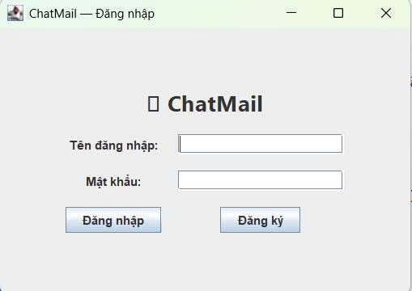
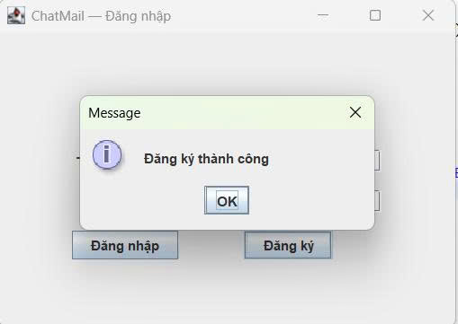
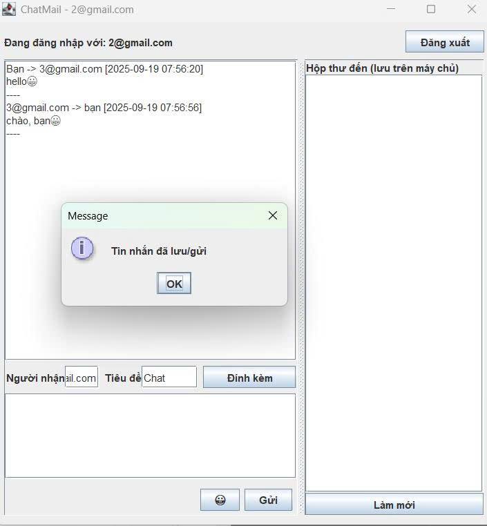
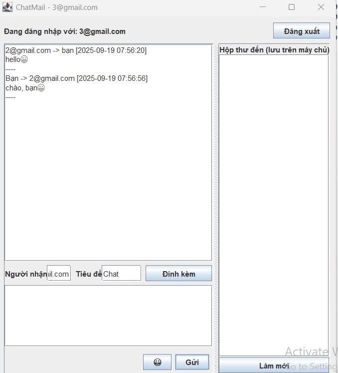

<h2 align="center">
    <a href="https://dainam.edu.vn/vi/khoa-cong-nghe-thong-tin">
    🎓 Faculty of Information Technology (DaiNam University)
    </a>
</h2>
<h2 align="center">
   GỬI EMAIL MÔ PHỎNG SMTP QUA SOCKET
</h2>

    

        
        
        
    

## 📖 1. Giới thiệu

Đề tài: Gửi email mô phỏng qua SMTP bằng Socket

Mục tiêu: Xây dựng hệ thống mô phỏng quá trình gửi email qua giao thức SMTP (Simple Mail Transfer Protocol).

Cách hoạt động:

Người dùng nhập thông tin email (người gửi, người nhận, tiêu đề, nội dung, tệp đính kèm) qua giao diện Swing.

Client gửi các lệnh SMTP qua TCP Socket đến Server.

Server xử lý yêu cầu, phản hồi theo chuẩn mã SMTP, sau đó lưu email thành file .txt trong thư mục mailbox/.

Ứng dụng mô phỏng này giúp sinh viên hiểu rõ hơn về cách một máy khách (email client) như Outlook, Gmail hoạt động khi giao tiếp với máy chủ SMTP, nhưng trong phạm vi an toàn và đơn giản hơn (lưu file thay vì gửi email thật).

## 📌 2. Công nghệ sử dụng

- Trong quá trình xây dựng hệ thống mô phỏng gửi email qua giao thức SMTP bằng Socket, nhóm sử dụng các công nghệ chính sau:

2.1. Ngôn ngữ lập trình Java

Java là ngôn ngữ lập trình hướng đối tượng, đa nền tảng, chạy trên JVM (Java Virtual Machine) với phương châm "Write Once, Run Anywhere".

Trong hệ thống này, Java được lựa chọn vì:

Hỗ trợ mạnh mẽ lập trình Socket và đa luồng (multithreading).

Thư viện I/O phong phú để đọc/ghi dữ liệu giữa client – server.

Có cộng đồng lớn, tài liệu hỗ trợ phong phú.

Dễ dàng xây dựng giao diện đồ họa Swing để nhập email và quản lý tương tác người dùng..

2.2. Socket trong Java

Socket là điểm cuối (endpoint) cho quá trình giao tiếp giữa Client – Server qua mạng.

ServerSocket: tạo máy chủ, lắng nghe yêu cầu.

Socket: tạo kết nối từ client đến server.

InputStream / OutputStream: trao đổi dữ liệu qua kết nối.

Trong ứng dụng này:

Server mở cổng 2525 và chờ Client kết nối.

Client gửi các lệnh SMTP như:

HELO → chào server

MAIL FROM → khai báo địa chỉ gửi

RCPT TO → khai báo địa chỉ nhận

DATA → gửi nội dung email

QUIT → thoát kết nối

Server phản hồi bằng mã chuẩn SMTP:

220 (Ready), 250 (OK), 354 (Start mail input), 221 (Bye).

 Việc sử dụng TCP Socket đảm bảo dữ liệu được gửi tin cậy, đúng thứ tự, mô phỏng sát cách thức SMTP hoạt động trong thực tế.

2.3. Mô hình Client – Server

Hệ thống được xây dựng theo kiến trúc Client – Server:

Client: Giao diện người dùng (Swing), nhập thông tin email → gửi lệnh SMTP đến server.

Server: Nhận lệnh SMTP, xử lý, phản hồi → lưu email thành file .txt.

2.4. IDE: Eclipse / IntelliJ IDEA

Để phát triển ứng dụng, nhóm sử dụng IDE hỗ trợ Java:

Eclipse: miễn phí, phổ biến.

IntelliJ IDEA: hiện đại, hỗ trợ nhiều tiện ích như debug, gợi ý code.

Ưu điểm khi dùng IDE:

Quản lý project và các file .java rõ ràng.

Debug và chạy chương trình thuận tiện.

Quan sát log SMTP Client – Server trực tiếp trong console

 ## 💻 3. Các hình ảnh chức năng
 3.1 Phần Giao Diện Đăng Nhập Và Đăng Ký

ChatMail — Đăng nhập.

Logo / Tiêu đề giữa màn hình: hiển thị tên ứng dụng ChatMail.
Tên đăng nhập: nơi người dùng nhập tên tài khoản.
Mật khẩu: nơi nhập mật khẩu, thường được ẩn ký tự.
Nút chức năng:
Đăng nhập: để xác thực thông tin người dùng.
Đăng ký: mở form đăng ký tài khoản mới.

  

<i>Hình ảnh Giao Diên </i>

 3.2 Đăng kí 
- Khi người dùng điền thông tin và xác nhận đăng ký:

- Ứng dụng gọi tới DatabaseHelper

- Nếu đăng ký thành công → lưu thông tin vào database.

- Nếu tên đăng nhập đã tồn tại → báo lỗi để nhập lại.

  

<i>Hình ảnh Đăng Ký Thành Công </i>

3.3 Khung Chat

Khung bên trái (lịch sử hội thoại/chat):
Hiển thị tin nhắn đã gửi và nhận giữa 2 tài khoản (ví dụ 2@gmail.com ↔ 3@gmail.com).

Tin nhắn có kèm dấu thời gian [yyyy-MM-dd HH:mm:ss].

Có thể thêm emoji 😁 (như bạn thấy trong ảnh).

Khung bên phải (Hộp thư đến):
Hiển thị các thư được lưu trên máy chủ (SMTP/Database).

Thanh nhập liệu (gửi tin nhắn):

Người nhận: nhập email người nhận (ví dụ: 2@gmail.com).

Tiêu đề: nhập chủ đề (ở đây là “Chat”).

Đính kèm: có nút chọn file để gửi kèm.

Ô nhập văn bản tin nhắn.

Nút Gửi: để gửi tin đi.

Nút emoji để chèn icon cảm xúc.

Khung điều khiển bên phải:

Nút Làm mới: để tải lại hộp thư đến.

  

<i>Hình ảnh 1 </i>

  

<i>Hình ảnh 2 </i>

## ⚙️ 4. Các bước cài đặt

1. Tạo Project mới

Mở Eclipse → File → New → Java Project.

Đặt tên project, ví dụ: EmailApp.

Bấm Finish.

2. Thêm các file mã nguồn

Trong project vừa tạo, mở thư mục src.

Copy tất cả các file .java bạn đã tải lên (LoginApp.java, MainApp.java, SMTPClient.java, SMTPServer.java, DatabaseHelper.java, EmailMessage.java, Attachment.java, Command.java, Response.java) vào thư mục src.

Eclipse sẽ tự động biên dịch nếu không có lỗi.

3. Thêm thư viện SQLite JDBC

Vì dự án có file DatabaseHelper.java → chắc chắn dùng SQLite, bạn cần thêm thư viện JDBC driver:

Tải sqlite-jdbc-<phiên_bản>.jar từ Maven Central 

Trong Eclipse, click chuột phải vào project → Build Path → Configure Build Path.

Chọn tab Libraries → Add External JARs….

Thêm file sqlite-jdbc-xxx.jar.

Bấm Apply and Close.

4. Xác định class chạy chính

Nếu chương trình mở màn hình đăng nhập trước → chạy LoginApp.java.

Nếu chương trình quản lý chính ở MainApp.java → chạy file đó.
(Thường thì MainApp là entry point, nhưng bạn có thể mở file .java và kiểm tra có public static void main(String[] args) trong đó để biết class nào là main).

5. Chạy chương trình

Trong Package Explorer, chọn file MainApp.java hoặc LoginApp.java.

Nhấn chuột phải → Run As → Java Application.

Ứng dụng sẽ chạy, và có thể tạo file database (.db) trong thư mục gốc project.

6. Kiểm tra database (nếu cần)

Sau khi chạy, bạn sẽ thấy file .db trong thư mục project.

Có thể mở bằng DB Browser for SQLite để xem dữ liệu.

## 📞 5. Liên hệ
- 💌 Email: nvn60211@gmail.com  
- ☎️ SĐT: 0866659701

© 2025 AIoTLab, Faculty of Information Technology, DaiNam University. All rights reserved.

---
